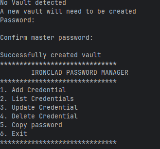
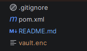
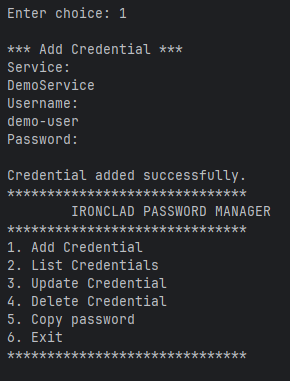
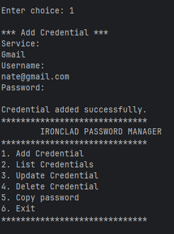
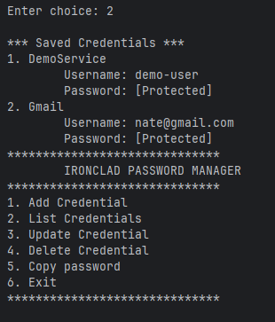
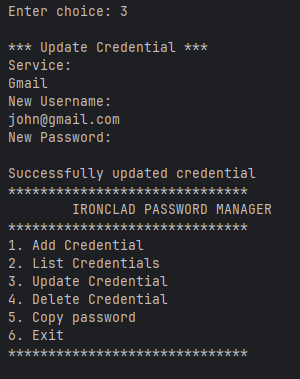
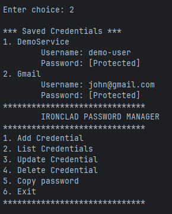
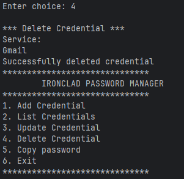
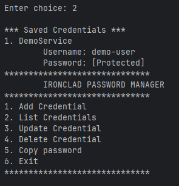
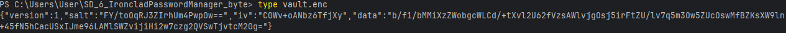

# Ironclad Password Manager

[](https://codecov.io/gh/NatePombi/finance-tracker-api-aws)


Ironclad is a command-line password manager built in Java. It securely stores credentials inside an encrypted local vault and provides an interactive CLI for managing them.

---

## Features

* Interactive command-line interface
* Create and unlock an encrypted password vault
* Master-password authentication
* AES-256 encryption using AES-GCM
* PBKDF2-HMAC-SHA256 key derivation
* Secure credential storage
* Add credentials
* List stored credentials without displaying passwords
* Update credentials
* Delete credentials
* Copy passwords to the system clipboard
* Automatic clipboard clearing after 15 seconds
* Validation for invalid and empty CLI input
* Encrypted vault persistence
* Atomic vault saves
* Rollback protection when credential updates cannot be persisted
* Automated unit and security tests

---

## Security

Ironclad does not store the master password or plaintext credentials in the vault.

The master password is used with PBKDF2-HMAC-SHA256 to derive a 256-bit AES key. Credentials are then encrypted using AES-GCM.

Each vault save uses a randomly generated salt and initialization vector (IV).

AES-GCM also provides authentication, meaning that an incorrect password or modified ciphertext causes decryption to fail rather than silently producing trusted plaintext.

---


## Requirements

Before running Ironclad, make sure you have:

* Java 17 or later
* Maven
* Git

Ironclad uses Maven to manage dependencies and run the automated test suite.

---

## Getting Started

Clone the repository:

```bash
git clone git@github.com:NatePombi/Sd_6_IroncladPasswordManager_byte.git
cd Sd_6_IroncladPasswordManager_byte
```

Build the project:

```bash
mvn clean package
```

Run the automated tests:

```bash
mvn test
```

---

## Running Ironclad

Ironclad requires a real terminal because secure password input uses Java's `System.console().readPassword()`.

Run the application from a terminal using the Maven-built application or your IDE.

When Ironclad starts for the first time, it creates a new encrypted vault and prompts the user to create a master password.

On subsequent launches, Ironclad detects the existing vault and requests the master password to unlock it.

---

## CLI Operations

After unlocking the vault, the interactive menu provides:

1. Add Credential
2. List Credentials
3. Update Credential
4. Delete Credential
5. Copy Password
6. Exit

Passwords are not displayed when credentials are listed.

When a password is copied to the system clipboard, Ironclad automatically attempts to clear it after 15 seconds.


---

## Vault Storage

The local encrypted vault is stored as:

```text
vault.enc
```

The vault contains encrypted credential data together with the information required to derive the encryption key and decrypt the vault.

The local vault file is intentionally excluded from Git using `.gitignore`.

**We Never commit a real vault containing personal credentials or secrets to GitHub.**

---

## Project Structure
### Project Structure

```text
src/
├── main/java/com/arithmatrix/ironclad/
│   ├── cli/          # User interface
│   ├── clipboard/    # Clipboard operations
│   ├── crypto/       # Encryption/decryption
│   ├── model/        # Data models
│   ├── storage/      # Credential storage
│   ├── vaultStorage/ # Vault persistence
│   └── Main.java
└── test/
```

---

## Main Components

### Main
Controls application startup, vault creation/unlocking, the interactive menu, and CLI operations.

### Credential
Represents a stored credential containing a service, username, and password.

### CredentialStore
Manages credentials in memory and provides CRUD operations.

### EncryptionService
Handles password-based key derivation, AES-GCM encryption/decryption, random salts, random IVs, and Base64 encoding.

### VaultStorage
Serializes credentials, encrypts the credential data, and persists the encrypted vault to disk.

### ClipboardService
Copies passwords to the system clipboard and attempts to clear them after 15 seconds.

---

## Future Improvements

### Possible future improvements include:

* Stronger filesystem permission handling
* More comprehensive integration testing
* Improved platform-specific clipboard handling
* Additional vault corruption recovery mechanisms
* Security review and penetration testing
* More robust configuration management

---

## Internship Deliverables

This project was developed as part of the **ArithMatrix Virtual Internship Program 2026 — Software Development**.

### GitHub Repository

The complete source code is maintained in the public GitHub repository.

### Sample Encrypted Vault

A sample encrypted vault can be generated locally by running Ironclad and creating a vault.

Real passwords and personal credentials should never be committed to the repository.

### Application Demonstration

A terminal screenshot or GIF demonstrating the following workflow will be included with the project:

1. Starting Ironclad
2. Creating or unlocking the vault
3. Adding a credential
4. Listing credentials
5. Updating a credential
6. Deleting a credential
7. Copying a password to the clipboard
8. Exiting the application

## Development

This project was developed using Java and Maven with a focus on:

* Object-oriented programming
* Secure cryptography
* File persistence
* Command-line application design
* Automated testing
* Error handling
* Git-based version control


---

## Screenshot Sample

## Terminal creating vault



## Created Vault 




## Terminal adding demo credential


## Terminal adding Second demo credential



## Terminal showing list of demo


## Terminal Updating credential



## Terminal showing updated credential


## Terminal delete demo credential



## Terminal show that demo was deleted


## Show Vault data, no passwords or sensitive data exposed 



